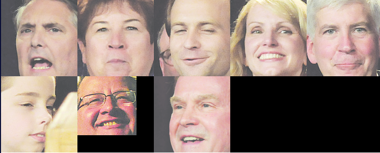

# DETECCIÓN DE ROSTROS Y TEXTO POR MEDIO DE OPEN CV Y TESSERACT

Este proyecto tiene como función la detección de rostros dentro de imágenes de periódicos por medio de Open CV, la condición para la selección de estos rostros se basa en la búsqueda de una palabra dentro de las distintas imágenes de periódico. Al encontrarse esta palabra en un periódico se procede a buscar los rostros que aparecen en la imagen, si ningún periódico contiene la palabra buscada no se mostrara ningún resultado.

##  Nota

Las dependencias, librerías necesarias para poder utilizar el proyecto se encuentran en `requirements.txt`, para poder instalarlas utilizar el siguiente comando:
```
pip install -r requirements.txt
```
Debido a que se utiliza Tesseract para el reconocimiento del texto es necesaria la instalación de Tesseract-OCR la cual se puede descargar de los siguientes enlaces:


* [Windows](https://github.com/UB-Mannheim/tesseract/wiki)
* [Mac y Linux](https://github.com/tesseract-ocr/tesseract/wiki)

Asegurarse que este se el directorio de la instalación, en caso contrario cambiar esto en el notebook.

```
pytesseract.pytesseract.tesseract_cmd = r'C:\Program Files\Tesseract-OCR\tesseract.exe
```

## Funcionamiento

Para la utilización del programa es necesario la selección de la palabra a buscar en la siguiente función:

```
face_image_collage("Christopher", list_files_small())
```
Donde se buscará en las distintas imágenes que se encontraran en:

```
./small_img/
```
Teniendo que al buscar la palabra "Christopher" se dentro de esta imagen se obtiene:



